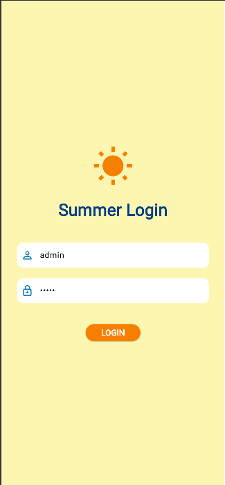
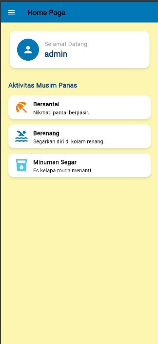
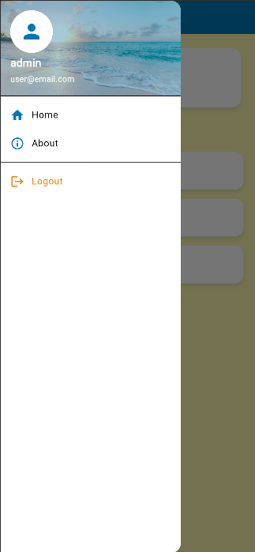

# H1D023018_Tugas7 - Aplikasi Login Flutter

Ini adalah proyek tugas 7 untuk mata kuliah Pemrograman Mobile. Proyek ini mengimplementasikan aplikasi Flutter sederhana dengan fitur login, *routes*, *side menu*, dan penyimpanan lokal, yang dikemas dalam tema *stylish* bernuansa musim panas (Summer).

## ✨ Fitur Utama

* **Autentikasi Pengguna:** Login sederhana dengan kredensial statis (`admin/admin`).
* **Penyimpanan Lokal:** Menggunakan `shared_preferences` untuk menyimpan sesi login (username).
* **Navigasi Modern:** Implementasi *routes* dan *side menu* (Drawer) yang *stylish*.
* **Logout:** Fitur untuk menghapus sesi dari `shared_preferences` dan kembali ke halaman login.
* **Tema Kustom:** Tampilan modern "Summer" dengan palet warna, *font*, dan *style* komponen yang konsisten di seluruh aplikasi.

## Tampilan Aplikasi

| Halaman Login | Halaman Utama (Home) |
| :---: | :---: |
|  |  |

| Side Menu (Drawer) | Halaman About |
| :---: | :---: |
|  |  |

## 📁 Penjelasan Tiap Bagian (Struktur Kode)

Proyek ini dibagi menjadi beberapa file utama di dalam folder `lib/`:

### 1. `main.dart`

* **Fungsi:** Titik awal (entry point) aplikasi.
* **Penjelasan:** File ini bertanggung jawab untuk:
    1.  Menjalankan aplikasi (`runApp`).
    2.  Mengatur tema global (Summer) untuk seluruh aplikasi menggunakan `ThemeData`. Ini mencakup palet warna (navbar, button, background), *style* `TextField`, dan *style* `CardThemeData`.
    3.  Mengarahkan pengguna ke `LoginPage()` sebagai halaman pertama saat aplikasi dibuka.

### 2. `login_page.dart`

* **Fungsi:** Halaman login untuk autentikasi pengguna.
* **Penjelasan:** Ini adalah `StatefulWidget` yang berisi dua `TextEditingController` untuk username dan password. Logika utamanya adalah:
    * `_handleLogin()`: Memeriksa apakah input yang dimasukkan adalah `admin/admin`.
    * `_saveUsername()`: Jika login berhasil, fungsi ini menyimpan username ke `shared_preferences`.
    * `_showDialog()`: Menampilkan dialog status (berhasil atau gagal) kepada pengguna.
* **Perbedaan Modul:** Tampilan diubah total menjadi lebih modern dengan *styling* dari `main.dart`, tanpa menggunakan fungsi `_showInput` (diganti `TextField` langsung).

### 3. `home_page.dart`

* **Fungsi:** Halaman utama yang ditampilkan setelah login berhasil.
* **Penjelasan:** Ini adalah `StatefulWidget` yang memanggil `_loadUsername()` saat `initState()` (saat halaman dimuat). Fungsi `_loadUsername` mengambil data username yang tersimpan di `shared_preferences` dan menampilkannya di UI. Halaman ini juga menyertakan `SideMenu` untuk navigasi.

### 4. `sidemenu.dart`

* **Fungsi:** Widget *drawer* (side menu) yang dapat digunakan kembali di berbagai halaman.
* **Penjelasan:** Ini adalah modifikasi kreatif dari modul. Dibuat sebagai `StatefulWidget` agar bisa:
    1.  Memuat username secara independen dan menampilkannya di `UserAccountsDrawerHeader` (tampilan header yang lebih modern).
    2.  Menangani logika **Logout**.
* **Fitur Tambahan:** Memiliki fungsi `_handleLogout()` yang akan menghapus *session* (`username`) dari `shared_preferences` dan mengarahkan pengguna kembali ke `LoginPage` (menggunakan `pushAndRemoveUntil` agar riwayat navigasi terhapus).

### 5. `about_page.dart`

* **Fungsi:** Halaman "About" statis yang diakses dari *side menu*.
* **Penjelasan:** Halaman `StatelessWidget` sederhana yang menampilkan informasi tentang aplikasi. Halaman ini juga wajib menyertakan `SideMenu` agar navigasi tetap konsisten.

---

### Akun untuk Login

* **Username:** `admin`
* **Password:** `admin`
